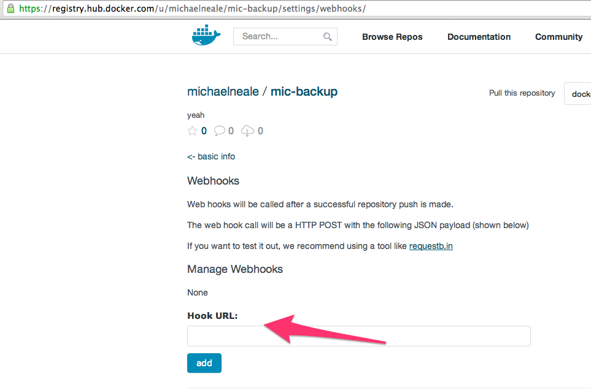
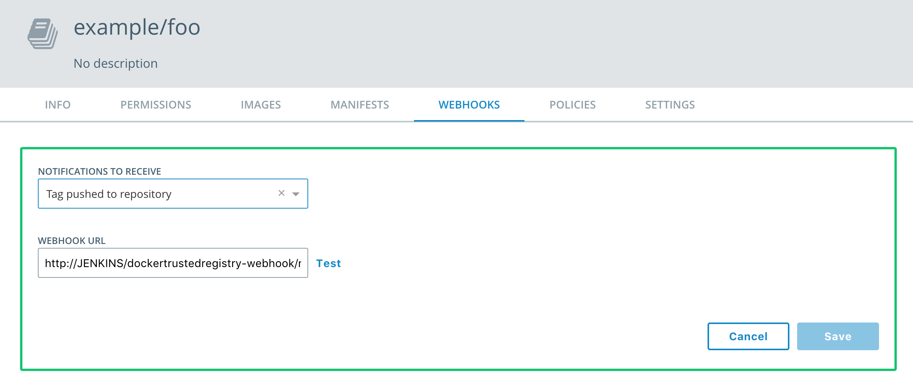
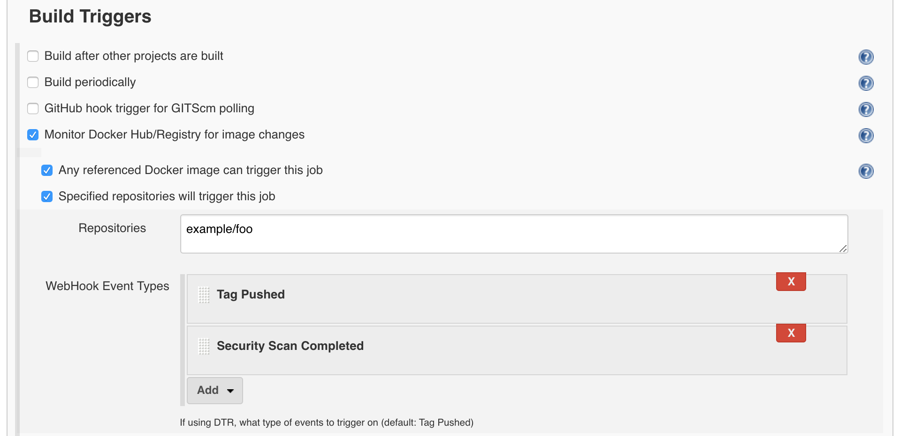

CloudBees Docker Hub/Registry Notification
================

This plugin provides integration between 
* Jenkins and Docker Hub
* Jenkins and Docker Registry 2.0
* Jenkins and Docker Trusted Registry (DTR)

, utilizing webhooks to trigger one (or more) Jenkins job(s).
This allows you to implement continuous delivery pipelines based on Docker in Jenkins.

Upon receiving a new image notification, Jenkins will trigger all jobs that have the Docker Hub/Registry trigger
enabled and use the incoming Docker image as part of the Build.  A `DockerHub Pull` build step is provided to retrieve
the latest image from Hub.

# Configuring Docker Hub

Configure your Docker Hub repository with a webhook to your public jenkins instance `http://JENKINS/dockerhub-webhook/notify`

In your <a href="https://hub.docker.com/">hub.docker.com</a> repository, you can find the "webhooks" section and point it to your jenkins instance: 



# Configuring Docker Registry 2.0

Follow Docker Registry 2.0 [documentation](https://docs.docker.com/registry/notifications/) on how to configure registry so that it would send notifications to `http://JENKINS/dockerregistry-webhook/notify`

The simplest viable configuration looks like this:
```
  notifications:
    endpoints:
      - name: jenkinslistener
        url: http://JENKINS/dockerregistry-webhook/notify
        timeout: 500ms
        threshold: 5
        backoff: 1s
```

# Configuring Azure Container Registry

You can find a detailed guide on how to configure webhooks on ACR on
[docs.microsoft.com](https://docs.microsoft.com/en-us/azure/container-registry/container-registry-webhook).
Use `http://JENKINS/acr-webhook/notify` as "Service URI".

# Configuring Docker Trusted Registry

The basic setup is done by opening the "WEBHOOKS" tab in a DTR repository, click "New Webhook" and fill in the form with to send notifications to `http://JENKINS/dockertrustedregistry-webhook/notify`.



See Docker Trusted Registry [documentation](https://docs.docker.com/datacenter/dtr/2.4/guides/user/create-and-manage-webhooks/) for full details on how to configure DTR webhooks.

Note that DTR offers discreet webhooks for several different notification types so additional configuration may be needed in your Jenkins project "Build Triggers" section.  By default, Jenkins will trigger a build for only DTR, `"TAG_PUSH"`, notifications; if you wish to build for other types you will need to open the "Advanced" section in the configuration and select which event types to listen for.



Currently, this plugin supports all event types available in DTR 2.4:
* Tag pushed to repository: `TAG_PUSH`  (Default)
* Tag deleted on repoitory: `TAG_DELETE`
* Manifest pushed to repository `MANIFEST_PUSH`
* Manifest deleted on repository `MANIFEST_DELETE`
* Security scan completed: `SCAN_COMPLETED`


# Examples

Payloads submitted by the hub:

* [Payload from your own repository](src/test/resources/own-repository-payload.json).
* [Payload from a public repository](src/test/resources/public-repository-payload.json).

Payloads submitted by the registry:

* [Payload from your own registry](/src/test/resources/private-registry-payload-1-repository.json).

The plugin can be tested with

```bash
    curl -X POST -H "Content-Type: application/json" http://localhost:8080/jenkins/dockerhub-webhook/notify -d @src/test/resources/public-repository-payload.json
```
